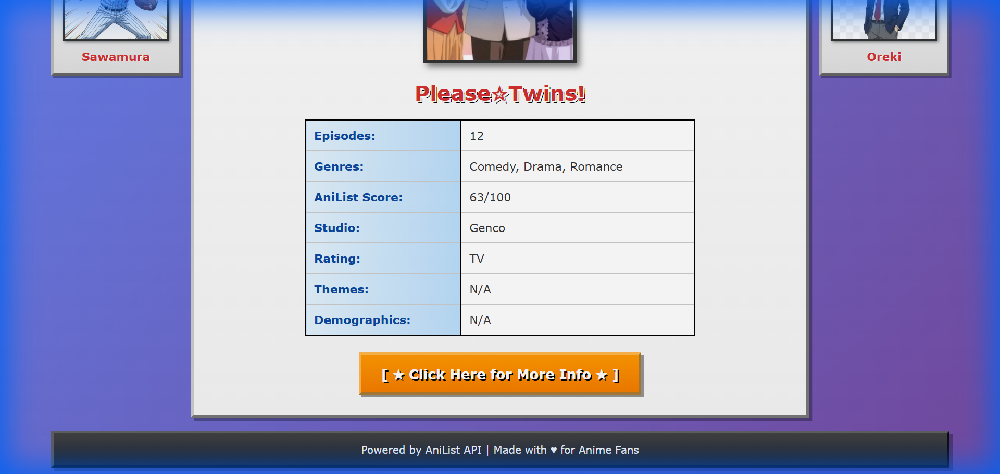

# 🌟 Retro Anime Generator 🌟

A late 2000s era styled random anime generator powered by the AniList API.



## Features

- **Retro Aesthetics**: Late 2000s web design with outset borders, gradients, and classic fonts
- **Character Decorations**: Sidebar images of beloved anime characters
- **Random Anime Discovery**: One-click random anime generation
- **Comprehensive Stats**: Episodes, genres, scores, studios, themes, and more
- **Direct Links**: Quick access to full anime details on AniList

## How to Run

### Prerequisites
- Python 3.x (for local server)

### Steps

1. Navigate to the project directory:
```bash
cd "d:\AntiGravity Projects\retro-anime-generator"
```

2. Start a local HTTP server:
```bash
python -m http.server 8000
```

3. Open your browser and visit:
```
http://localhost:8000
```

4. Click the **"★ GENERATE RANDOM ANIME ★"** button to discover anime!

> **Important**: Do not open `index.html` directly using `file://` protocol as this will cause CORS errors with the AniList API.

## Project Structure

```
retro-anime-generator/
├── index.html              # Main HTML file
├── README.md              # This file
├── src/
│   ├── styles.css        # Retro styling
│   └── app.js            # AniList API integration
└── public/
    └── images/           # Character images
        ├── chitanda_cursor.png
        ├── doraemon.png
        ├── inori.png
        ├── oreki.png
        └── sawamura.png
```

## Displayed Information

Each random anime shows:
- Cover image
- Title (English or Romaji)
- Number of episodes
- Genres
- AniList score (out of 100)
- Production studio
- Rating/Format
- Themes
- Demographics
- Link to AniList page

## Character Images

The website features AI-generated placeholder images of:
- **Doraemon** (Doraemon)
- **Sawamura Eijun** (Ace of Diamond)
- **Inori Yuzuriha** (Guilty Crown)
- **Oreki Houtarou** (Hyouka)

You can replace these with your own images by updating the PNG files in `public/images/`.

## Technologies Used

- HTML5
- CSS3 (with retro styling)
- Vanilla JavaScript
- AniList GraphQL API

## API

This project uses the [AniList GraphQL API](https://anilist.gitbook.io/anilist-apiv2-docs/) which requires no authentication for public data queries.

## License

Free to use and modify for personal projects.

---

Made with ♥ for Anime Fans

